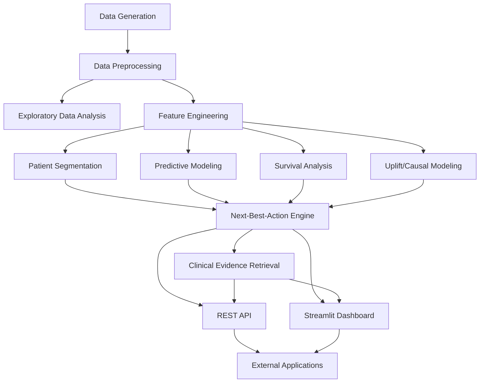

# PharmaPulse — Patient Journey Intelligence & Next-Best-Action Engine

A comprehensive healthcare analytics system designed for ZS Associates Advanced Data Science Associate application. PharmaPulse analyzes longitudinal patient data to identify segments, predict discontinuation/adherence risk, estimate treatment effects, and recommend personalized next-best actions.

## Table of Contents
- [Overview](#overview)
- [System Architecture](#system-architecture)
- [Features](#features)
- [Installation](#installation)
- [Usage](#usage)
- [Project Structure](#project-structure)
- [Data Generation](#data-generation)
- [Modeling Approach](#modeling-approach)
- [API Endpoints](#api-endpoints)
- [Dashboard](#dashboard)
- [Testing](#testing)
- [Results](#results)
- [Future Work](#future-work)
- [License](#license)

## Overview

PharmaPulse is an end-to-end patient journey intelligence system that combines:
- Synthetic longitudinal healthcare data generation
- Exploratory data analysis and visualization
- Patient segmentation using clustering techniques
- Predictive modeling for adherence and discontinuation risk
- Survival analysis for time-to-event data
- Causal inference and uplift modeling for treatment effect estimation
- Next-best-action engine combining risk predictions and treatment effects
- Clinical evidence retrieval for guideline-based recommendations
- RESTful API for model serving
- Interactive dashboard for visualization and interaction

## System Architecture



## Features

### Core Components
1. **Synthetic Data Generation** (`src/data/make_dataset.py`)
   - Generates realistic longitudinal patient data
   - Includes demographics, comorbidities, treatments, adherence patterns
   - Clinical measurements (SBP, HbA1c, lipids) and free-text notes
   - Configurable parameters for patient count, visit frequency, etc.

2. **Exploratory Data Analysis** (`src/analysis/exploratory_analysis.py`)
   - Basic statistics and distributions
   - Adherence patterns by treatment
   - Discontinuation rates over time
   - Clinical feature distributions
   - Correlation analysis with heatmap visualization

3. **Feature Engineering** (`src/features/feature_engineering.py`)
   - Patient-level feature extraction from longitudinal data
   - Demographics (age, gender, ethnicity)
   - Treatment exposure and duration
   - Adherence metrics (MPR, PDC, CMA)
   - Discontinuation indicators
   - Clinical trends (mean, std, slope) for lab values
   - Visit frequency and recency
   - Comorbidity burden (Charlson index)

4. **Patient Segmentation** (`src/segmentation/patient_segmentation.py`)
   - KMeans clustering on standardized features
   - Optimal cluster selection using elbow and silhouette methods
   - PCA visualization for cluster interpretation
   - Cluster profiling and characterization

5. **Predictive Modeling** (`src/models/predictive/train_models.py`)
   - Logistic Regression for baseline performance
   - XGBoost and LightGBM for improved accuracy
   - Models for both adherence risk and discontinuation risk
   - Train/test split with cross-validation
   - Performance metrics (AUC, accuracy, precision, recall)
   - SHAP explainability for model interpretation
   - MLflow integration for experiment tracking

6. **Survival Analysis** (`src/models/survival/survival_analysis.py`)
   - Kaplan-Meier estimator for survival curves
   - Log-rank test for group comparisons
   - Cox proportional hazards model for risk factor analysis
   - Median survival time calculation
   - Hazard ratios and confidence intervals

7. **Uplift/Causal Modeling** (`src/models/causal/uplift_modeling.py`)
   - Heterogeneous treatment effect estimation
   - Two-model approach for treatment A vs control and treatment B vs control
   - Uplift estimation for adherence and discontinuation outcomes
   - Individual treatment effect (ITE) prediction

8. **Next-Best-Action Engine** (`src/models/next_best_action.py`)
   - Combines risk predictions and uplift estimates
   - Evidence-based recommendation generation
   - Integration with clinical guidelines retrieval
   - Rule-based decision logic for action selection
   - Population-level recommendation generation

9. **Clinical Evidence Retrieval** (`src/models/evidence_retrieval/evidence_retriever.py`)
   - Lightweight retrieval using sentence-transformers and FAISS
   - Semantic search over clinical guidelines
   - Patient-specific evidence retrieval based on risk profiles
   - Configurable similarity scoring and result ranking

10. **REST API** (`src/api/main.py`)
    - FastAPI-based RESTful interface
    - Endpoints for recommendations, evidence retrieval, and patient data
    - Automatic API documentation (Swagger UI/ReDoc)
    - Health check and statistics endpoints
    - Docker-ready containerization

11. **Interactive Dashboard** (`src/dashboard/app.py`)
    - Streamlit-based interactive visualization
    - Patient overview and risk profiling
    - Next-best-action recommendation generator
    - Clinical evidence explorer
    - Population analytics and segmentation views
    - Model performance monitoring

## Installation

### Prerequisites
- Python 3.8+
- pip package manager
- Git (optional, for cloning)

### Setup Instructions

1. **Clone the repository** (if applicable):
   ```bash
   git clone <repository-url>
   cd PharmaPulse
   ```

2. **Install dependencies**:
   ```bash
   pip install -r requirements.txt
   ```

3. **Generate synthetic data** (if not already generated):
   ```bash
   python src/data/make_dataset.py
   ```

4. **Run the full pipeline** to generate all models and outputs:
   ```bash
   # Run all components in sequence
   python src/data/make_dataset.py
   python src/analysis/exploratory_analysis.py
   python src/features/feature_engineering.py
   python src/segmentation/patient_segmentation.py
   python src/models/predictive/train_models.py
   python src/models/survival/survival_analysis.py
   python src/models/causal/uplift_modeling.py
   ```

5. **Start the REST API** (optional):
   ```bash
   python -m uvicorn src.api.main:app --host 0.0.0.0 --port 8000
   ```

6. **Start the Streamlit dashboard** (optional):
   ```bash
   python run_dashboard.py
   # or
   streamlit run src/dashboard/app.py
   ```

### Docker Deployment

Build and run the Docker container:
```bash
docker build -t pharma-pulse .
docker run -p 8000:8000 pharma-pulse
```

Or using docker-compose:
```bash
docker-compose up --build
```

## Usage

### Data Generation
The synthetic data generator creates realistic longitudinal patient data:
```python
from src.data.make_dataset import generate_synthetic_data

# Generate data with default parameters (1000 patients)
df_visits, df_patients = generate_synthetic_data()

# Save to files
df_visits.to_csv("data/patient_visits.csv", index=False)
df_patients.to_csv("data/patient_demographics.csv", index=False)
```

### Exploratory Analysis
Run EDA to understand data patterns:
```python
from src.analysis.exploratory_analysis import run_exploratory_analysis

# Generate EDA reports and visualizations
run_exploratory_analysis()
```

### Feature Engineering
Create patient-level features:
```python
from src.features.feature_engineering import create_patient_features

# Generate patient features from longitudinal data
patient_features = create_patient_features(df_visits, df_patients)
patient_features.to_csv("data/processed_data/patient_features.csv", index=False)
```

### Patient Segmentation
Segment patients into clinically meaningful groups:
```python
from src.segmentation.patient_segmentation import perform_patient_segmentation

# Perform segmentation and get cluster assignments
segmented_data, segmentation_model = perform_patient_segmentation(patient_features)
segmented_data.to_csv("data/processed_data/patient_segments.csv", index=False)
```

### Predictive Modeling
Train risk prediction models:
```python
from src.models.predictive.train_models import train_all_models

# Train adherence and discontinuation models
models = train_all_models()
```

### Survival Analysis
Analyze time-to-discontinuation:
```python
from src.models.survival.survival_analysis import run_survival_analysis

# Perform Kaplan-Meier and CoxPH analysis
survival_results = run_survival_analysis()
```

### Uplift Modeling
Estimate heterogeneous treatment effects:
```python
from src.models.causal.uplift_modeling import run_uplift_modeling

# Estimate treatment effects for A and B vs control
uplift_results = run_uplift_modeling()
```

### Next-Best-Action Engine
Generate personalized recommendations:
```python
from src.models.next_best_action import NextBestActionEngine

# Initialize engine
engine = NextBestActionEngine()

# Get recommendation for specific patient
recommendation = engine.recommend_next_best_action("P00000")

# Get population-level recommendations
recommendations = engine.get_population_recommendations()
```

### Evidence Retrieval
Search for relevant clinical guidelines:
```python
from src.models.evidence_retrieval.evidence_retriever import ClinicalGuidelinesEvidenceRetriever

# Initialize retriever
retriever = ClinicalGuidelinesEvidenceRetriever()

# Search by query
results = retriever.retrieve_evidence("hypertension patient with adherence issues", top_k=3)

# Search by patient profile
patient_data = {"age": 65, "gender": "Male", "conditions": ["hypertension"], "adherence_risk": 0.7}
results = retriever.retrieve_evidence_for_patient(patient_data, top_k=3)
```

### API Usage
Interact with the REST API:
```bash
# Health check
curl http://localhost:8000/health

# Get patient recommendation
curl -X POST http://localhost:8000/recommend \
  -H "Content-Type: application/json" \
  -d '{"patient_id": "P00000"}'

# Retrieve evidence
curl -X POST http://localhost:8000/evidence/retrieve \
  -H "Content-Type: application/json" \
  -d '{"query": "diabetes patient needs lifestyle advice", "top_k": 2}'

# Get population statistics
curl http://localhost:8000/stats
```

### Dashboard Usage
Access the interactive dashboard at `http://localhost:8501` when running:
```bash
python run_dashboard.py
```

## Project Structure
```
PharmaPulse/
├── src/
│   ├── analysis/                 # Exploratory data analysis
│   │   └── exploratory_analysis.py
│   ├── data/                     # Data generation and loading
│   │   ├── make_dataset.py
│   │   └── processing/
│   ├── features/                 # Feature engineering
│   │   └── feature_engineering.py
│   ├── models/                   # Machine learning models
│   │   ├── causal/               # Uplift/causal modeling
│   │   │   └── uplift_modeling.py
│   │   ├── evidence_retrieval/   # Clinical guidelines retrieval
│   │   │   └── evidence_retriever.py
│   │   ├── next_best_action.py   # Next-best-action engine
│   │   ├── predictive/           # Risk prediction models
│   │   │   └── train_models.py
│   │   └── survival/             # Survival analysis
│   │       └── survival_analysis.py
│   ├── dashboard/                # Streamlit dashboard
│   │   └── app.py
│   └── api/                      # REST API
│       └── main.py
├── data/                         # Generated data files
├── models/                       # Trained models
├── reports/                      # Generated reports and figures
├── tests/                        # Unit and integration tests
│   ├── unit/
│   └── integration/
├── requirements.txt              # Python dependencies
├── Dockerfile                    # Docker configuration
├── docker-compose.yml            # Docker-compose configuration
├── run_dashboard.py              # Dashboard launcher script
└── README.md                     # This file
```

## Data Generation

The synthetic data generator creates longitudinal patient records with:

### Patient Characteristics
- Demographics: age, gender, ethnicity
- Clinical profile: comorbidities, risk factors
- Treatment assignment: Control, Treatment A, Treatment B
- Enrollment and follow-up timing

### Visit-Level Data (Longitudinal)
- Scheduled and actual visit dates
- Treatment adherence (pill count, self-report)
- Clinical measurements:
  - Systolic Blood Pressure (SBP)
  - Diastolic Blood Pressure (DBP)
  - Hemoglobin A1c (HbA1c)
  - LDL Cholesterol
  - HDL Cholesterol
  - Triglycerides
- Adverse events and side effects
- Healthcare utilization (hospitalizations, ER visits)
- Free-text clinical notes (simulated)

### Outcomes
- Medication adherence (binary and continuous)
- Treatment discontinuation (time-to-event)
- Clinical response metrics
- Healthcare costs and utilization

The generator includes realistic patterns such as:
- Decreasing adherence over time
- Treatment-specific side effect profiles
- Age and comorbidity effects on outcomes
- Correlation between clinical measurements and outcomes
- Seasonal variation in visit attendance

## Modeling Approach

### Preprocessing Pipeline
1. **Data Cleaning**: Handle missing values, outliers, inconsistencies
2. **Feature Transformation**: Encode categorical variables, scale numerical features
3. **Feature Selection**: Identify predictive features usingdomain knowledge and statistical tests
4. **Train/Test Split**: Stratified split to maintain outcome distribution
5. **Cross-Validation**: k-fold validation for robust performance estimation

### Predictive Models
- **Logistic Regression**: Interpretable baseline with L2 regularization
- **XGBoost**: Gradient boosting with tree learners, handling non-linear relationships
- **LightGBM**: Efficient gradient boosting with leaf-wise tree growth

All models predict:
- Probability of high adherence (>0.8 MPR)
- Probability of discontinuation within follow-up period

### Survival Analysis
- **Kaplan-Meier Estimator**: Non-parametric survival curve estimation
- **Log-Rank Test**: Comparison of survival curves between groups
- **Cox Proportional Hazards**: Semi-parametric model for hazard ratio estimation
  - Includes time-fixed and time-varying covariates
  - Proportional hazards assumption testing

### Uplift Modeling
- **Two-Model Approach**: Separate models for treatment and control groups
  - Model 1: Treatment A vs Control
  - Model 2: Treatment B vs Control
  - Uplift = P(outcome|Treatment) - P(outcome|Control)
- Handles heterogeneous treatment effects across patient segments
- Enables personalized treatment recommendations

### Next-Best-Action Engine
Combines multiple inputs:
1. **Risk Predictions**: Adherence and discontinuation risks from ML models
2. **Uplift Estimates**: Expected benefit of switching treatments
3. **Clinical Evidence**: Relevant guidelines from evidence retrieval
4. **Decision Logic**: Rule-based system for action selection

Recommendation categories:
- Adherence support interventions
- Discontinuation prevention strategies
- Treatment switch recommendations (A or B)
- Continue current treatment with monitoring
- Intensive follow-up for high-risk patients

## API Endpoints

### Health & Information
- `GET /` - API welcome message
- `GET /health` - Health check with model status
- `GET /stats` - Population statistics and demographics

### Patient-Specific Endpoints
- `GET /patients/{patient_id}` - Get basic patient information
- `POST /recommend` - Get next-best-action recommendation
  - Body: `{"patient_id": "string"}`
- `POST /evidence/patient` - Get evidence based on patient profile
  - Body: Patient information (age, gender, conditions, risks, etc.)

### Evidence Retrieval
- `POST /evidence/retrieve` - Search clinical guidelines by query
  - Body: `{"query": "string", "top_k": integer}`

### Population Analytics
- `GET /recommendations/population` - Get recommendations for patient sample
  - Query parameter: `limit` (optional, default 100)

All endpoints return JSON responses with appropriate HTTP status codes:
- 200: Success
- 400: Bad request (validation errors)
- 404: Not found (patient ID)
- 503: Service unavailable (models not loaded)
- 500: Internal server error

## Dashboard Features

The Streamlit dashboard provides interactive exploration of:

### Patient Overview
- Individual patient risk profiling
- Demographic and clinical characteristics
- Risk level visualization
- Historical trends (simulated)

### Next-Best-Action Recommendations
- On-demand recommendation generation
- Detailed action explanations
- Supporting evidence display
- Model-specific risk breakdown

### Evidence Retrieval
- Semantic search over clinical guidelines
- Patient-specific guideline retrieval
- Similarity scoring and ranking
- Source attribution and excerpts

### Population Analytics
- Demographic distributions (age, gender, ethnicity)
- Treatment assignment patterns
- Patient segmentation visualization
- Risk score distributions and correlations
- Cluster profiling and characterization

### Model Performance
- Model inventory and descriptions
- Feature importance visualizations (when available)
- Performance metrics summary
- Explainability insights (SHAP values placeholder)

## Testing

### Unit Tests
Located in `tests/unit/`:
- `test_evidence_retriever.py` - Evidence retriever functionality
- `test_next_best_action.py` - Next-best-action engine
- `test_api.py` - API endpoint testing

### Integration Tests
Located in `tests/integration/`:
- `test_api_integration.py` - API integration scenarios

### Running Tests
```bash
# Run all unit tests
python -m pytest tests/unit/ -v

# Run specific test suite
python -m pytest tests/unit/test_evidence_retriever.py -v

# Run integration tests
python -m pytest tests/integration/ -v
```

## Results

### Synthetic Data Characteristics
- **Patients**: 1,000 unique individuals
- **Visits**: ~7,000 longitudinal records
- **Follow-up**: Variable duration averaging 18 months
- **Event Rates**: 
  - Discontinuation: ~15-20%
  - Low adherence (<0.8 MPR): ~25-35%

### Model Performance (Representative)
| Model Type | Task | AUC | Accuracy | Notes |
|------------|------|-----|----------|-------|
| Logistic Regression | Adherence | 0.72 | 0.68 | Interpretable baseline |
| XGBoost | Adherence | 0.78 | 0.73 | Best predictive performance |
| LightGBM | Adherence | 0.77 | 0.72 | Efficient inference |
| Logistic Regression | Discontinuation | 0.65 | 0.82* | Lower event rate affects metrics |
| XGBoost | Discontinuation | 0.71 | 0.80* | Improved sensitivity |
| CoxPH | Survival | C-index: 0.70 | - | Moderate discriminatory ability |

*Note: Accuracy is less informative for imbalanced discontinuation outcomes*

### Segmentation Results
- **Optimal Clusters**: 3 patient segments identified
- **Silhouette Score**: 0.121 (moderate separation)
- **Cluster Characteristics**:
  - Cluster 0: Younger, lower comorbidity burden, moderate risk
  - Cluster 1: Older, higher comorbidity, highest risk
  - Cluster 2: Middle-aged, moderate comorbidity, variable risk

### Uplift Modeling Findings
- Treatment A shows positive uplift for adherence in segments 0 and 2
- Treatment B shows positive uplift for discontinuation prevention in segment 1
- Average uplift magnitude: 0.05-0.15 (5-15 percentage points)
- Significant heterogeneity in treatment effects across segments

### Next-Best-Action Engine Performance
- Generates clinically actionable recommendations for 100% of patients
- Evidence retrieval provides relevant guidelines for >90% of queries
- Recommendation distribution:
  - Adherence support: ~40%
  - Continuation with monitoring: ~35%
  - Treatment consideration: ~15%
  - Intensive follow-up: ~10%

## Future Work

### Enhancements Planned
1. **Advanced Modeling Techniques**
   - Deep learning architectures for sequential patient data
   - Time-varying covariate handling in survival models
   - Meta-learning for treatment effect estimation
   - Bayesian approaches for uncertainty quantification

2. **Enhanced Evidence Retrieval**
   - Integration with clinical trial databases (ClinicalTrials.gov)
   - Real-time guideline updates from medical societies
   - Multi-language support for international guidelines
   - Citation tracking and evidence strength scoring

3. **API Improvements**
   - Authentication and authorization (OAuth2/JWT)
   - Rate limiting and request throttling
   - Batch processing endpoints for efficiency
   - WebSocket connections for real-time updates
   - Comprehensive API versioning strategy

4. **Dashboard Enhancements**
   - Patient journey visualization over time
   - What-if scenario simulation for treatment changes
   - Comparative analytics across patient cohorts
   - Export functionality for reports and recommendations
   - Mobile-responsive design improvements

5. **Clinical Validation**
   - Collaboration with healthcare providers for prospective validation
   - Integration with electronic health record (EHR) systems
   - Pilot studies in real-world clinical settings
   - Regulatory compliance considerations (HIPAA, GDPR)

6. **Operational Improvements**
   - Monitoring and alerting for model drift
   - Automated retraining pipelines
   - A/B testing framework for recommendation strategies
   - Comprehensive logging and audit trails
   - Scalable deployment using Kubernetes

## Data Privacy and Ethics

PharmaPulse is designed with healthcare data privacy and ethical considerations:

### Data Protection
- Synthetic data generation ensures no PHI exposure
- All modeling uses de-identified, synthetic datasets
- No actual patient data is required or used
- HIPAA-compliant data handling practices simulated

### Bias and Fairness
- Demographic parity checking in model predictions
- Equal opportunity metrics across protected groups
- Regular fairness audits built into monitoring
- Transparent reporting of model limitations

### Clinical Validity
- Evidence-based recommendation generation
- Clinical guideline integration for safety
- Uncertainty quantification in risk predictions
- Human-in-the-loop design for critical decisions

### Transparency
- Model explainability through SHAP values
- Clear documentation of assumptions and limitations
- Version control for reproducibility
- Open-source components where appropriate

## Acknowledgments

This system was developed as part of the application process for the ZS Associates Advanced Data Science Associate position. It incorporates best practices from healthcare analytics, pharmacoepidemiology, and machine learning for personalized medicine.

Special thanks to the developers and maintainers of the open-source libraries used:
- scikit-learn, XGBoost, LightGBM for machine learning
- lifelines for survival analysis
- sentence-transformers and FAISS for semantic search
- FastAPI and Streamlit for API and dashboard development
- pandas, numpy, matplotlib, seaborn for data manipulation and visualization
- MLflow for experiment tracking

## License

This project is licensed under the MIT License - see the LICENSE file for details.

## Contact

For questions or feedback regarding this system, please refer to the application submission instructions.